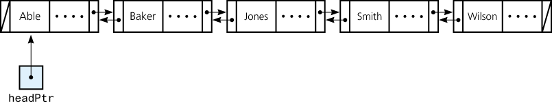
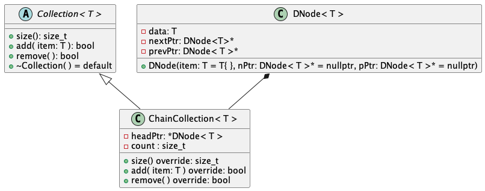

# LAB05: Nodes for a Doubly-Linked Chain

In a doubly linked chain, each node can point to the previous node as well as to the next node. Figure 4-10 shows a doubly linked chain and its head pointer. Define a class to represent a node in a doubly linked chain.



**Figure 4-10**

## Due Date

This assignment is due by 11:59:59 PM, Saturday, March 11, 2023.

## Background

For this lab, we shall implement a simplified version of `BagInterface`. Given to you in this lab is an interface named `Collection` that is based upon the following design.



In this lab, you shall develop the `DNode<T>` and `ChainCollection<T>` classes.

Let's study this class diagram.

Firstly, let's focus on `Collection`. This is the interface that will be implemented by `ChainCollection`. The `Collection` interface is a class template, so just like the `BagInterface` introduced in Chapter 1, this ADT is parameterized by some type. 

For example, consider this non-member, client, function that has a parameter that is a pointer to a `Collection`:

```c++
/**
 * @brief Counts the number of items in the given Collection.
 * 
 * @param collectionPtr a pointer to a Collection of strings
 * @return the number of strings contained in the given Collection
 */
int count(const Collection<std::string>* collectionPtr);
```

In the previous function declaration, the parameter was a pointer to a _particular_ kind of Collection, namely, a Collection of strings. If we wanted to generalize this function, we would transform it into a non-member function template as follows:

```c++
/**
 * @brief Counts the number of items in the given Collection.
 * 
 * @param collectionPtr a pointer to a Collection of items of type T
 * @return the number of strings contained in the given Collection
 * @post the given collection remains unchanged
 */
template <typename T>
int count(const Collection<T>* collectionPtr);
```


### Advanced Reading

- General > Files > Class Materials > Setting Up WSL for CSC232.pdf
- Chapter 3, Carrano & Henry

## Objectives

- Extend the concept of a singly-linked chain to a doubly-linked chain
- Continue to interpret design class diagrams and implement them in C++

## Tasks

1. Task 1: Implement `DNode<T>`
2. Task 2: Implement Stubbed out `ChainCollection<T>`
3. Task 3: Implement `add()` and `remove()` member functions

### Task 1: Implement `DNode<T>`

In this task, we simply implement a "Plain Old Data" class for the nodes needed in a doubly-linked chain. From the class diagram (Figure 4-10), we see we have three attributes:

1. `data: T` - this is the data stored in the node; `T` is simply a template parameter
2. `prevPtr` - this is a pointer to another `DNode<T>`, namely the node that precedes this node in the chain. For the head node, this is the `nullptr`.
3. `nextPtr` - this ia a pointer to another `DNode<T>`, namely the node that follows this node in the chain. For the tail node, this is the `nullptr`.

Your task here then, is to create a class template named `DNode<T>` that encapsulates the above attributes.

Define an initializing constructor for the `DNode<T>` that allows for the initialization of any number of the three attributes. Default values should be specified all constructor parameters (use the default constructor of `T`, i.e., `T{ }`, for the `data` attribute and the `nullptr` as the default value for the two pointer attributes). 

Furthermore, it defines **accessor** (i.e., "getter") and **mutator** (i.e., "setter") methods for each of these three attributes.

1. Locate the `TODO: Task 1.1` in the `csc232.h` header file and declare the `DNode<T>` class in the space designated for this task.
2. Locate the `TODO: Task 1.2` in the `csc232.cpp` header file and define the `DNode<T>` member functions in the space designated for this task.
3. When you have completed this task, toggle the `SKIP_TESTING_TASK_1` macro from `TRUE` to `FALSE`.
4. Build and execute the `test_task1` target to test your solution. Alternatively, you can build and execute the `All CTest` target (in CLion, in general, running `ctest`).
5. When all the tests for this task pass, commit and push your changes to GitHub.

### Task 2: Implement Stubbed out `ChainCollection<T>`

Now it's time to implement the `Collection<T>` interface in our own doubly-linked chain implementation. As per the class diagram specification, we do this in a class named `ChainCollection<T>`. From the class diagram (Figure 4-10), we see we have two attributes:

1. `headPtr` - this is a pointer to the head node of the doubly-linked chain that stores the data maintained by this Collection.
2. `count` - a convenience data member that stores the number of nodes in the doubly-linked chain pointed to by `headPtr`

Your task here, then, is to create a class template named `ChainCollection` that extends the `Collection` abstract class, as shown in Figure 4-10. You will use the class diagram as your guide. For the operations inherited from the `Collection` interface, simply return 0 for the `size()` member function and `false` for the `add()` and `remove()` operations.

1. Locate the `TODO: Task 2.1` in the `csc232.h` header file and declare the `ChainCollection<T>` class (such that it implements the `Collection` interface) in the space designated for this task. 
2. Locate the `TODO: Task 2.2` in the `csc232.h` header file and define your stubbed out `ChainCollection<T>` member functions.
2. When you have completed this task, toggle the `SKIP_TESTING_TASK_2` macro from `TRUE` to `FALSE`.
3. Build and execute the `test_task2` target to test your solution. Alternatively, you can build and execute the `All CTest` target (in CLion, in general, running `ctest`).
4. When all the tests for this task pass, commit and push your changes to GitHub.

### Task 3

In this final task, you shall properly implement the `add()` and `remove()` operations inherited from `Collection<T>`.

1. Go back to your stubbed out implementation of the `add()` operation (which should be located in the `csc232.h` source file). Implement this method properly. Not only must you insert a new `DNode<T>` in the chain, but you must increment `count` accordingly.
2. Go back to your stubbed out implementation of the `remove()` operation (which should be located in the `csc232.h` source file). Implement this method properly. Not only must you remove the head `DNode<T>` from the chain (assuming it exists), but you must decrement `count` accordingly and return an appropriate boolean value.
3. When you have completed this task, toggle the `SKIP_TESTING_TASK_3` macro from `TRUE` to `FALSE`.
4. Build and execute the `test_task3` target to test your solution. Alternatively, you can build and execute the `All CTest` target (in CLion, in general, running `ctest`).
5. As a final check, be sure you have deleted all the `TODO` comment lines once you have actually completed said task.
6. When all the tests for this task pass, commit and push your changes to GitHub.

## Submission Details

Before submitting your assignment, be sure you have pushed all your changes to GitHub. If this is the first time you're pushing your changes, the push command will look like:

```bash
git push -u origin develop
```

If you've already set up remote tracking (using the `-u origin develop` switch), then all you need to do is type:

```bash
git push
```

As usual, prior to submitting your assignment on Blackboard, be sure that you have committed and pushed your final changes to GitHub. Once your final changes have been pushed, create a pull request that seeks to merge the changes in your `develop` branch into your `trunk` branch. Once your pull request has been created, submit the URL of your assignment _repository_ (i.e., _not_ the URL of the pull request) on the Teams Assignment. Please note: the timestamp of the submission on Teams is used to assess any late penalties if and when warranted, _not_ the date/time you create your pull request. **No exceptions will be granted for this oversight**.

### Grading Rubric

This assignment is worth **3 points**.

| Criteria           | Exceeds Expectations         | Meets Expectations                  | Below Expectations                  | Failure                                        |
|--------------------|------------------------------|-------------------------------------|-------------------------------------|------------------------------------------------|
| Pull Request (20%) | Submitted early, correct url | Submitted on-time; correct url      | Incorrect URL                       | No pull request was created or submitted       |
| Code Style (20%)   | Exemplary code style         | Consistent, modern coding style     | Inconsistent coding style           | No style whatsoever or no code changes present |
| Correctness^ (60%) | All unit tests pass          | At least 80% of the unit tests pass | At least 60% of the unit tests pass | Less than 50% of the unit tests pass           |

^ _The DocTest unit runner will calculate the correctness points based purely on the fraction of tests passed_.

### Late Penalty

* In the first 24-hour period following the due date, this lab will be penalized 0.6 point meaning the grading starts at 2.4 (out of 3 total possible) points.
* In the second 24-hour period following the due date, this lab will be penalized 1.2 points meaning the grading starts at 1.8 (out of 3 total possible) points.
* After 48 hours, the assignment will not be graded and thus earns no points, i.e., 0 out of 3 possible points.
